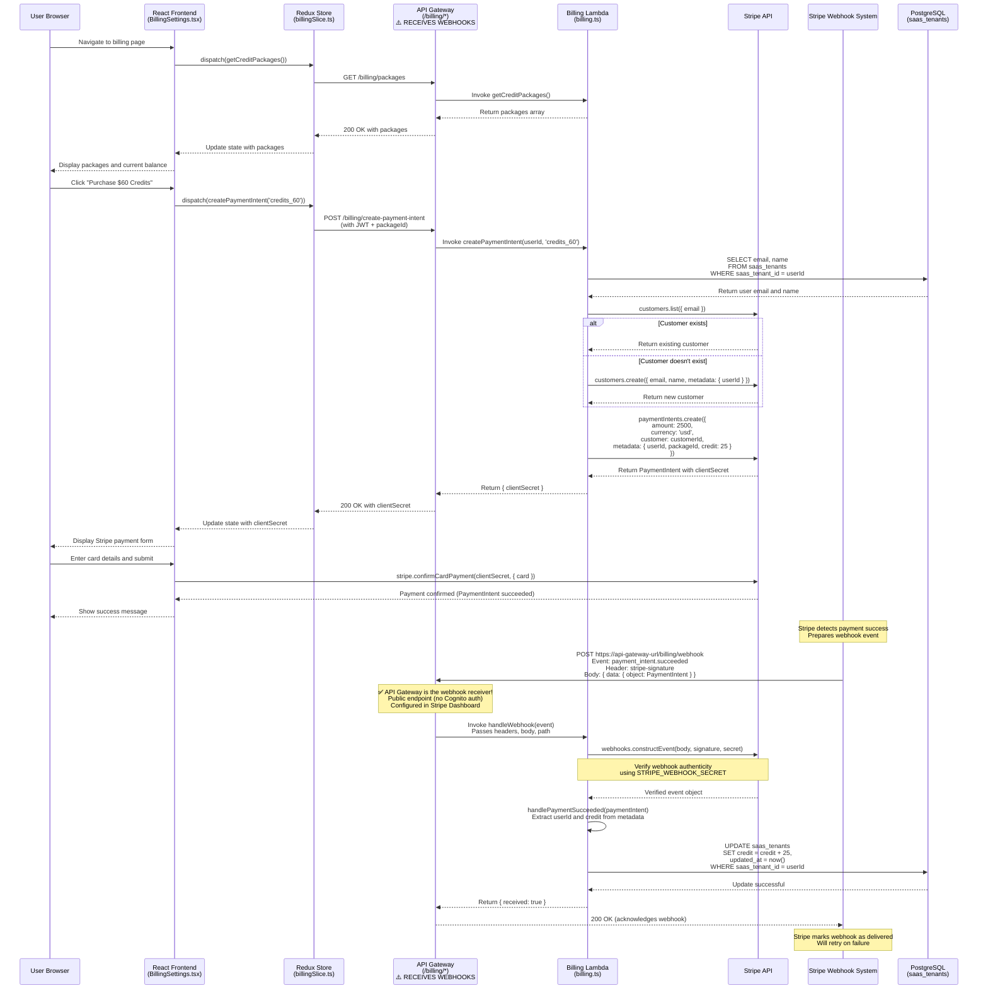

# Billing System Flow Specification

<!-- toc -->

- [Overview](#overview)
- [Architecture](#architecture)
  * [Components](#components)
- [Credit Packages](#credit-packages)
- [API Endpoints](#api-endpoints)
  * [1. GET /billing/packages](#1-get-billingpackages)
  * [2. POST /billing/create-payment-intent](#2-post-billingcreate-payment-intent)
  * [3. POST /billing/webhook](#3-post-billingwebhook)
- [Webhook Architecture](#webhook-architecture)
  * [How Stripe Webhooks Reach the Lambda](#how-stripe-webhooks-reach-the-lambda)
  * [Webhook Endpoint Setup](#webhook-endpoint-setup)
  * [Why No Authentication on Webhook Endpoint?](#why-no-authentication-on-webhook-endpoint)
- [Complete Purchase Flow](#complete-purchase-flow)
- [Detailed Flow Steps](#detailed-flow-steps)
  * [Phase 1: Initialization (Load Packages)](#phase-1-initialization-load-packages)
  * [Phase 2: Payment Intent Creation](#phase-2-payment-intent-creation)
  * [Phase 3: Payment Confirmation (Client-Side)](#phase-3-payment-confirmation-client-side)
  * [Phase 4: Webhook Processing (Server-Side)](#phase-4-webhook-processing-server-side)
- [Security Considerations](#security-considerations)
  * [Authentication & Authorization](#authentication--authorization)
  * [Data Protection](#data-protection)
- [Database Schema](#database-schema)
  * [saas_tenants Table](#saas_tenants-table)
- [Frontend Environment (from appConfig.json)](#frontend-environment-from-appconfigjson)
- [Error Handling](#error-handling)
  * [Frontend Error Handling](#frontend-error-handling)
  * [Backend Error Handling](#backend-error-handling)
  * [Webhook Failure Handling](#webhook-failure-handling)

<!-- tocstop -->

## Overview

The Summaries.AI billing system implements a credit-based payment system using Stripe for payment processing. Users can purchase credit packages that add funds to their account balance, which is then used to pay for AI services (LLM API calls, embeddings, etc.).

## Architecture

### Components

1. **Frontend (React + Redux)**

   - Location: `frontend/src/components/BillingSettings.tsx`
   - Location: `frontend/src/components/PaymentForm.tsx`
   - Location: `frontend/src/redux/billing/billingSlice.ts`

2. **Backend (AWS Lambda)**

   - Location: `backend/lambdas/billing/ts/billing.ts`

3. **Infrastructure (AWS CloudFormation)**

   - Location: `scripts/template.yaml`
   - Function Name: `BillingFunction-${AWS::StackName}`

4. **Database (PostgreSQL)**

   - Table: `saas_tenants`
   - Columns: `saas_tenant_id`, `credit`, `email`, `name`, `updated_at`

5. **Payment Processor (Stripe)**
   - Payment Intents API
   - Webhooks for payment events
   - Customer management

## Credit Packages

The system offers four predefined credit packages (hardcoded in `billing.ts`):

| Package ID  | Name         | Price |
| ----------- | ------------ | ----- |
| credits_20  | $20 Credits  | $20   |
| credits_60  | $60 Credits  | $60   |

## API Endpoints

All endpoints are exposed through API Gateway with the `/billing` prefix:

### 1. GET /billing/packages

- **Auth**: None (public)
- **Purpose**: Fetch available credit packages
- **Handler**: `getCreditPackages()`
- **Response**: Array of `ICreditPackage` objects

### 2. POST /billing/create-payment-intent

- **Auth**: Cognito JWT (required)
- **Purpose**: Create a Stripe Payment Intent for purchasing credit
- **Handler**: `createPaymentIntent(userId, packageId)`
- **Request Body**: `{ packageId: string }`
- **Response**: `{ clientSecret: string }`

### 3. POST /billing/webhook

- **Auth**: Stripe signature verification (required)
- **Purpose**: Handle Stripe webhook events
- **Handler**: `handleWebhook(event)`
- **Events Handled**:
  - `payment_intent.succeeded` → `handlePaymentSucceeded()`
  - `payment_intent.payment_failed` → `handlePaymentFailed()`

## Webhook Architecture

### How Stripe Webhooks Reach the Lambda

```
┌─────────────────┐
│  Stripe Server  │
└────────┬────────┘
         │ HTTP POST
         │ https://api-gateway-url/billing/webhook
         │ Headers: stripe-signature
         │ Body: { type: "payment_intent.succeeded", data: {...} }
         ▼
┌─────────────────────────────────────────┐
│         AWS API Gateway                 │
│  Route: POST /billing/webhook           │
│  Auth: NONE (public endpoint)           │
│  Integration: Lambda Proxy              │
└────────┬────────────────────────────────┘
         │ Invoke Lambda
         │ Event includes: headers, body, path, method
         ▼
┌─────────────────────────────────────────┐
│      Billing Lambda Function            │
│  Handler: billing.handler               │
│  Function: handleWebhook(event)         │
│                                         │
│  1. Extract stripe-signature header     │
│  2. Verify signature with Stripe SDK    │
│  3. Route event by type                 │
│  4. Process payment (update DB)         │
│  5. Return 200 OK                       │
└────────┬────────────────────────────────┘
         │ Update credit
         ▼
┌─────────────────────────────────────────┐
│      PostgreSQL Database                │
│  Table: saas_tenants                    │
│  UPDATE credit = credit + amount        │
└─────────────────────────────────────────┘
```

### Webhook Endpoint Setup

**Step 1: Deploy Infrastructure**

- CloudFormation creates API Gateway endpoint
- Lambda function is deployed with webhook handler
- Endpoint URL: `https://<api-id>.execute-api.<region>.amazonaws.com/<stage>/billing/webhook`

**Step 2: Configure Stripe Dashboard**

1. Go to Stripe Dashboard → Developers → Webhooks
2. Click "Add endpoint"
3. Enter the API Gateway webhook URL
4. Select events to listen for:
   - `payment_intent.succeeded`
   - `payment_intent.payment_failed`
5. Copy the webhook signing secret into `scripts/api-keys.ps1`

**Step 3: Verify Webhook**

- Stripe sends test webhook
- Lambda verifies signature and returns 200 OK
- Stripe marks endpoint as "Active"

### Why No Authentication on Webhook Endpoint?

The webhook endpoint has `Authorizer: NONE` in API Gateway because:

1. **Stripe doesn't support JWT tokens** - Webhooks come from Stripe's servers, not authenticated users
2. **Signature verification is the security mechanism** - The `stripe-signature` header proves the request came from Stripe
3. **Public endpoint is required** - Stripe needs to reach the endpoint from the internet

**Security is maintained through:**

- Webhook signature verification using `STRIPE_WEBHOOK_SECRET`
- HTTPS encryption in transit
- Lambda validates signature before processing any data
- Invalid signatures are rejected with 400 error

## Complete Purchase Flow



## Detailed Flow Steps

### Phase 1: Initialization (Load Packages)

**Files Involved:**

- Frontend: `frontend/src/components/BillingSettings.tsx`
- Redux: `frontend/src/redux/billing/billingSlice.ts`
- Backend: `backend/lambdas/billing/ts/billing.ts`

**Flow:**

1. User navigates to billing page
2. Frontend dispatches `getCreditPackages()` thunk
3. API call to `GET /billing/packages` (no auth required)
4. Lambda returns hardcoded `CREDIT_PACKAGES` array
5. Frontend displays packages

### Phase 2: Payment Intent Creation

**Files Involved:**

- Frontend: `frontend/src/components/PaymentForm.tsx`
- Redux: `frontend/src/redux/billing/billingSlice.ts`
- Backend: `backend/lambdas/billing/ts/billing.ts` (lines 169-202)

**Flow:**

1. User selects a credit package (e.g., "$60 Credits")
2. Frontend dispatches `createPaymentIntent(packageId)` thunk
3. API call to `POST /billing/create-payment-intent` with `{ packageId: 'credits_60' }`
4. Lambda validates package exists in `CREDIT_PACKAGES`
5. Lambda calls `getOrCreateStripeCustomer(userId)`:
   - Queries DB for user email and name
   - Searches Stripe for existing customer by email
   - Creates new Stripe customer if not found
6. Lambda creates Stripe Payment Intent:
   ```typescript
   stripe.paymentIntents.create({
     amount: 2500, // $25 in cents
     currency: 'usd',
     customer: customerId,
     metadata: {
       userId: 'user-123',
       packageId: 'credits_60',
       credit: '25',
     },
   });
   ```
7. Returns `clientSecret` to frontend
8. Frontend stores `clientSecret` in Redux state

### Phase 3: Payment Confirmation (Client-Side)

**Files Involved:**

- Frontend: `frontend/src/components/PaymentForm.tsx` (lines 60-85)
- Stripe.js SDK

**Flow:**

1. Frontend displays Stripe CardElement for user to enter payment details
2. User enters card number, expiry, CVC
3. User clicks "Subscribe" button
4. Frontend calls Stripe.js:
   ```typescript
   stripe.confirmCardPayment(clientSecret, {
     payment_method: { card: cardElement },
   });
   ```
5. Stripe processes payment directly (PCI-compliant)
6. Stripe returns `paymentIntent` with status `succeeded`
7. Frontend shows success message to user

### Phase 4: Webhook Processing (Server-Side)

**Files Involved:**

- Backend: `backend/lambdas/billing/ts/billing.ts` (lines 241-289)
- Infrastructure: `scripts/template.yaml` (lines 1088-1096)
- Stripe Dashboard: Webhook endpoint configuration

**Webhook Endpoint Configuration:**

The webhook endpoint is exposed through API Gateway and configured in the Stripe Dashboard:

```yaml
# From scripts/template.yaml
StripeWebhook:
  Type: Api
  Properties:
    Path: /billing/webhook
    Method: POST
    RestApiId: !Ref RestApi
    Auth:
      Authorizer: NONE # No Cognito auth - uses Stripe signature instead
```

**Full Webhook URL:** `https://<api-gateway-id>.execute-api.<region>.amazonaws.com/<stage>/billing/webhook`

This URL must be configured in the Stripe Dashboard under "Developers > Webhooks" to receive payment events.

**Flow:**

1. **Stripe sends webhook event** directly to API Gateway endpoint:
   - URL: `POST https://<api-gateway-url>/billing/webhook`
   - Headers include `stripe-signature` for verification
   - Body contains event data (e.g., `payment_intent.succeeded`)
2. **API Gateway** receives the webhook and invokes the Billing Lambda (no authorization check)
3. Lambda verifies webhook signature:
   ```typescript
   stripe.webhooks.constructEvent(event.body, stripeSignature, STRIPE_WEBHOOK_SECRET);
   ```
4. Lambda routes event based on type:
   - `payment_intent.succeeded` → `handlePaymentSucceeded()`
   - `payment_intent.payment_failed` → `handlePaymentFailed()`
5. For successful payment:
   - Extract `userId` and `credit` from `paymentIntent.metadata`
   - Update PostgreSQL:
     ```sql
     UPDATE saas_tenants
     SET credit = credit + 25,
         updated_at = now()
     WHERE saas_tenant_id = 'user-123'
     ```
6. Lambda returns `{ received: true }` to API Gateway
7. API Gateway returns `200 OK` to Stripe (acknowledges webhook receipt)

## Security Considerations

### Authentication & Authorization

1. **JWT Token Extraction** (`getUserIdFromEvent()` in `billing.ts` line 107):

   - Extracts JWT from `Authorization: Bearer <token>` header
   - Decodes JWT payload to get `sub` or `userId`
   - Used for all authenticated endpoints

2. **Cognito Authorizer** (CloudFormation template):

   - `/billing/balance` - requires Cognito JWT
   - `/billing/create-payment-intent` - requires Cognito JWT
   - `/billing/packages` - public (no auth)
   - `/billing/webhook` - Stripe signature verification

3. **Stripe Webhook Verification** (`handleWebhook()` line 241):
   - Verifies `stripe-signature` header
   - Uses `STRIPE_WEBHOOK_SECRET` to validate authenticity
   - Prevents unauthorized credit additions

### Data Protection

1. **Sensitive Data in Secret Manager**.

   - `STRIPE_PUBLISHABLE_KEY`
   - `STRIPE_SECRET_KEY`
   - `STRIPE_WEBHOOK_SECRET`

2. **VPC Configuration**:

   - Lambda runs in private subnets
   - PostgreSQL accessible only from VPC
   - Security groups control network access

3. **CORS Headers**:
   - Configured in Lambda response
   - Restricts frontend origins
   - Allows only necessary HTTP methods

## Database Schema

### saas_tenants Table

```sql
CREATE TABLE saas_tenants (
  saas_tenant_id VARCHAR(255) PRIMARY KEY,  -- User ID from Cognito
  email VARCHAR(255) NOT NULL,
  name VARCHAR(255),
  credit DECIMAL(10, 2) DEFAULT 0.00,       -- Credit balance in dollars
  updated_at TIMESTAMP DEFAULT CURRENT_TIMESTAMP,
  -- ... other columns
);
```

## Frontend Environment (from appConfig.json)

```json
{
  "API_GW_REST_API_URL": "https://api.example.com",
  "STRIPE_PUBLISHABLE_KEY": "pk_test_..."
}
```

## Error Handling

### Frontend Error Handling

**Location:** `frontend/src/redux/billing/billingSlice.ts`

- All async thunks use `rejectWithValue()` for error handling
- Errors stored in Redux state: `state.error`
- Displayed to user via Material-UI `Alert` components
- Auto-cleared after 5 seconds

### Backend Error Handling

**Location:** `backend/lambdas/billing/ts/billing.ts`

- Try-catch blocks around all async operations
- Errors logged to CloudWatch: `console.error()`
- Returns appropriate HTTP status codes:
  - `400` - Bad request (invalid webhook signature)
  - `401` - Unauthorized (missing JWT)
  - `404` - Not found (invalid package, user not found)
  - `500` - Internal server error (unexpected errors)

### Webhook Failure Handling

- Stripe retries failed webhooks automatically
- Lambda must return `200 OK` to acknowledge receipt
- Failed webhook processing logged but doesn't block payment
- Consider implementing dead-letter queue for failed webhooks
